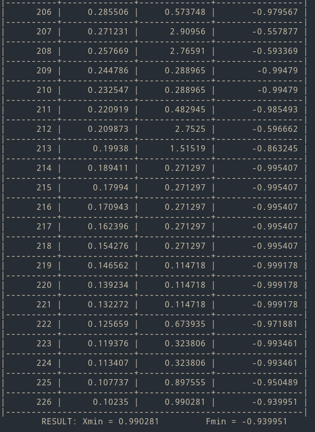

# Лабораторная работа №3 по Теории систем и системному анализу

Вариант 1
## Задание
1. На интервале [-5, 2] задана унимодальная функция одной переменной -0.5*cos(0.5x) - 0.5. Используя метод имитации отжига осуществить поиск минимума функции.
2. При аналогичных условиях осуществить поиск минимума предыдущей функции, модулированной сигналом sin(5*x), т.е. мультимодальной функции f(x) = (-0.5 * cos(0.5x) - 05) * sin(5x).
Используя метод случайного поиска осуществить поиск минимума фунции на заданном интервале с заданной вероятностью попадания в окрестность экстремума P при 
допустимой длинне интервала неопределенности.

## Выполнение лабораторной работы

Реализация работы программы находится в следующих файлах: demo.cpp, annealing.cpp.
Результат работы программы приведен на скриншотах.

